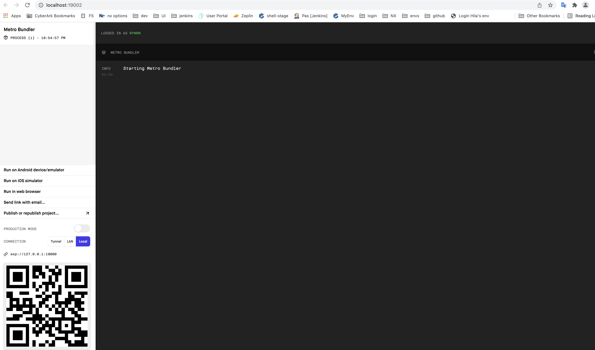

# Jobli

Jobli is a react native project, written with javascript.

## Environment setup

### prerequisite

install android or ios emulator to run the

run command: `npm install -g expo-cli`

for more info about installat react native with expo: https://reactnative.dev/docs/environment-setup

notes: 

- we using Expo CLI to run the app.
- install android or ios emulator to run the app on your compunetr, it's not a required step becaues you can run by scan the qr-code
## Run the app

- run commnad: `npm install`

- run commnad: `npm start` (will open an expo local server)

### Run on Android

when expo local server is up and available in `http://localhost:19002/` you will need to change connection to `local` and then press `Run on Android device/emulator`

  

## Build APK file for Android

### pre requisite

the build of apk file made in the expo servers so you will need to connect your local environment to account in expo website.

- create account in `https://expo.dev/`

- run commnad `npm run expo:login` 

### Build

- run command `npm run build:android` 

this command will trigger a build in the `https://expo.dev/` website and when it's done you will be able to download the apk file from `https://expo.dev/` (when the build is succeeded you will get specific link to the build in your account).

### Publish

Upload the file to Google Play Store console.